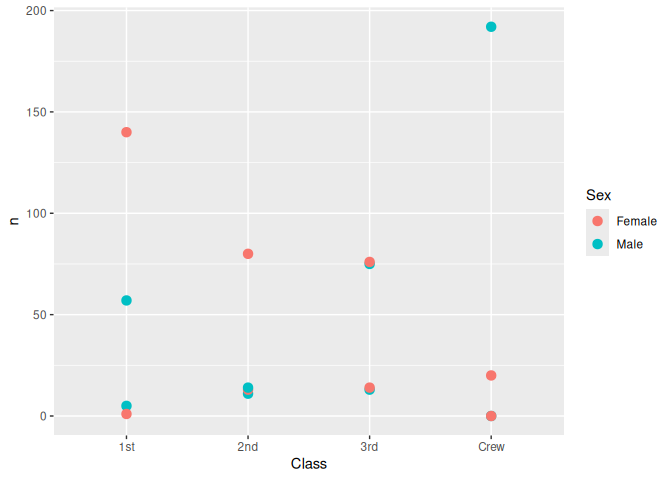
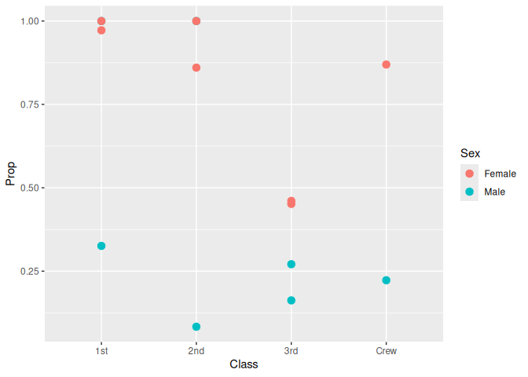
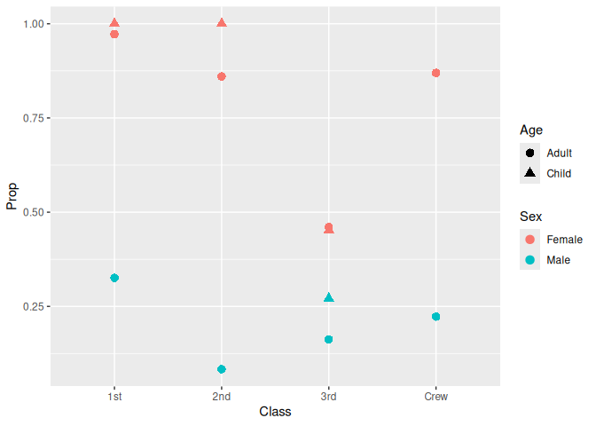

RMS Titanic
================
(Your name here)
2020-

- [Grading Rubric](#grading-rubric)
  - [Individual](#individual)
  - [Submission](#submission)
- [First Look](#first-look)
  - [**q1** Perform a glimpse of `df_titanic`. What variables are in
    this
    dataset?](#q1-perform-a-glimpse-of-df_titanic-what-variables-are-in-this-dataset)
  - [**q2** Skim the Wikipedia article on the RMS Titanic, and look for
    a total count of souls aboard. Compare against the total computed
    below. Are there any differences? Are those differences large or
    small? What might account for those
    differences?](#q2-skim-the-wikipedia-article-on-the-rms-titanic-and-look-for-a-total-count-of-souls-aboard-compare-against-the-total-computed-below-are-there-any-differences-are-those-differences-large-or-small-what-might-account-for-those-differences)
  - [**q3** Create a plot showing the count of persons who *did*
    survive, along with aesthetics for `Class` and `Sex`. Document your
    observations
    below.](#q3-create-a-plot-showing-the-count-of-persons-who-did-survive-along-with-aesthetics-for-class-and-sex-document-your-observations-below)
- [Deeper Look](#deeper-look)
  - [**q4** Replicate your visual from q3, but display `Prop` in place
    of `n`. Document your observations, and note any new/different
    observations you make in comparison with q3. Is there anything
    *fishy* in your
    plot?](#q4-replicate-your-visual-from-q3-but-display-prop-in-place-of-n-document-your-observations-and-note-any-newdifferent-observations-you-make-in-comparison-with-q3-is-there-anything-fishy-in-your-plot)
  - [**q5** Create a plot showing the group-proportion of occupants who
    *did* survive, along with aesthetics for `Class`, `Sex`, *and*
    `Age`. Document your observations
    below.](#q5-create-a-plot-showing-the-group-proportion-of-occupants-who-did-survive-along-with-aesthetics-for-class-sex-and-age-document-your-observations-below)
- [Notes](#notes)

*Purpose*: Most datasets have at least a few variables. Part of our task
in analyzing a dataset is to understand trends as they vary across these
different variables. Unless we’re careful and thorough, we can easily
miss these patterns. In this challenge you’ll analyze a dataset with a
small number of categorical variables and try to find differences among
the groups.

*Reading*: (Optional) [Wikipedia
article](https://en.wikipedia.org/wiki/RMS_Titanic) on the RMS Titanic.

<!-- include-rubric -->

# Grading Rubric

<!-- -------------------------------------------------- -->

Unlike exercises, **challenges will be graded**. The following rubrics
define how you will be graded, both on an individual and team basis.

## Individual

<!-- ------------------------- -->

| Category | Needs Improvement | Satisfactory |
|----|----|----|
| Effort | Some task **q**’s left unattempted | All task **q**’s attempted |
| Observed | Did not document observations, or observations incorrect | Documented correct observations based on analysis |
| Supported | Some observations not clearly supported by analysis | All observations clearly supported by analysis (table, graph, etc.) |
| Assessed | Observations include claims not supported by the data, or reflect a level of certainty not warranted by the data | Observations are appropriately qualified by the quality & relevance of the data and (in)conclusiveness of the support |
| Specified | Uses the phrase “more data are necessary” without clarification | Any statement that “more data are necessary” specifies which *specific* data are needed to answer what *specific* question |
| Code Styled | Violations of the [style guide](https://style.tidyverse.org/) hinder readability | Code sufficiently close to the [style guide](https://style.tidyverse.org/) |

## Submission

<!-- ------------------------- -->

Make sure to commit both the challenge report (`report.md` file) and
supporting files (`report_files/` folder) when you are done! Then submit
a link to Canvas. **Your Challenge submission is not complete without
all files uploaded to GitHub.**

``` r
library(tidyverse)
```

    ## ── Attaching core tidyverse packages ──────────────────────── tidyverse 2.0.0 ──
    ## ✔ dplyr     1.2.1     ✔ readr     2.2.0
    ## ✔ forcats   1.0.1     ✔ stringr   1.6.0
    ## ✔ ggplot2   4.0.3     ✔ tibble    3.3.1
    ## ✔ lubridate 1.9.5     ✔ tidyr     1.3.2
    ## ✔ purrr     1.2.2     
    ## ── Conflicts ────────────────────────────────────────── tidyverse_conflicts() ──
    ## ✖ dplyr::filter() masks stats::filter()
    ## ✖ dplyr::lag()    masks stats::lag()
    ## ℹ Use the conflicted package (<http://conflicted.r-lib.org/>) to force all conflicts to become errors

``` r
df_titanic <- as_tibble(Titanic)
```

*Background*: The RMS Titanic sank on its maiden voyage in 1912; about
67% of its passengers died.

# First Look

<!-- -------------------------------------------------- -->

### **q1** Perform a glimpse of `df_titanic`. What variables are in this dataset?

``` r
## TASK: Perform a `glimpse` of df_titanic
df_titanic |> glimpse()
```

    ## Rows: 32
    ## Columns: 5
    ## $ Class    <chr> "1st", "2nd", "3rd", "Crew", "1st", "2nd", "3rd", "Crew", "1s…
    ## $ Sex      <chr> "Male", "Male", "Male", "Male", "Female", "Female", "Female",…
    ## $ Age      <chr> "Child", "Child", "Child", "Child", "Child", "Child", "Child"…
    ## $ Survived <chr> "No", "No", "No", "No", "No", "No", "No", "No", "No", "No", "…
    ## $ n        <dbl> 0, 0, 35, 0, 0, 0, 17, 0, 118, 154, 387, 670, 4, 13, 89, 3, 5…

``` r
df_titanic
```

    ## # A tibble: 32 × 5
    ##    Class Sex    Age   Survived     n
    ##    <chr> <chr>  <chr> <chr>    <dbl>
    ##  1 1st   Male   Child No           0
    ##  2 2nd   Male   Child No           0
    ##  3 3rd   Male   Child No          35
    ##  4 Crew  Male   Child No           0
    ##  5 1st   Female Child No           0
    ##  6 2nd   Female Child No           0
    ##  7 3rd   Female Child No          17
    ##  8 Crew  Female Child No           0
    ##  9 1st   Male   Adult No         118
    ## 10 2nd   Male   Adult No         154
    ## # ℹ 22 more rows

**Observations**:

- This is a dataset pertaining to people on the RMS titanic. There are 5
  unique variables: Class, Sex, Female, Survived and n. The Class
  variable is seems to refer to the type of ticket they bought, and
  seems to be this set of strings: 1st, 2nd, 3rd, and Crew. The Sex
  variable seems to be the gender of the passengers and seems to be this
  set of strings: Male, Female. The Age variable categorizes the
  passengers into 2 categories, picked from this set of strings: Child,
  Adult. The Survived variable categorizes the passengers into whether
  they survived (most likeley the crash of the Titanic) and picks from
  either a Yes or No string. Finally the n variable counts the number of
  people in a specific category there were. For example, the first row
  counts the number of male children, that had a first class ticket and
  did not survive. n = 0, which means that there were 0 passengers
  meeting that criteria. All of these variables combined give us a
  comprehensive summary of the passengers in the Titanic.

### **q2** Skim the [Wikipedia article](https://en.wikipedia.org/wiki/RMS_Titanic) on the RMS Titanic, and look for a total count of souls aboard. Compare against the total computed below. Are there any differences? Are those differences large or small? What might account for those differences?

``` r
## NOTE: No need to edit! We'll cover how to
## do this calculation in a later exercise.
df_titanic %>% summarize(total = sum(n))
```

    ## # A tibble: 1 × 1
    ##   total
    ##   <dbl>
    ## 1  2201

**Observations**:

- Write your observations here
- Are there any differences?
  - The Wikipedia article claims that there were about 2208 people on
    board, whereas this dataset claims there were 2201.
- If yes, what might account for those differences?
  - Digging deeper into the Wikipedia article, they do say that no one
    has been able to determine an exact count of the people who actually
    boarded the RMS Titanic. Around 50 people cancelled last minute, and
    other people got off at various stops it made, before the
    transatlantic journey. I hypothesize that the dataset might only be
    counting the number of people that sureley made that transatlantic
    journey, since everyone in the dataset has a survived or not
    variable, and the titanic crashed on the transatlantic journey.

### **q3** Create a plot showing the count of persons who *did* survive, along with aesthetics for `Class` and `Sex`. Document your observations below.

*Note*: There are many ways to do this.

``` r
## TASK: Visualize counts against `Class` and `Sex`
df_titanic |> 
  filter(Survived == "Yes") |> 
  ggplot() + geom_point(mapping = aes(
    x = Class,
    y = n,
    colour = Sex
  ),
  size = 3
  )
```

<!-- -->

**Observations**:

- This is a plot of the number of people that survived, seperated by
  Class and Sex.
- This plot is a little confusing because each Class label has 4 dots,
  signifying Female Children, Male Children, Female Adult, and Male
  Adults. Because we haven’t plotted Children vs. Adults, it is
  impossible to tell the difference in this graph
- According to this graph, the Male Crew Members were the population
  that had the most number of people that survived, followed by first
  class female passengers.
- We also have no clue if all passengers of a certain type died, or
  there were never any in the first place. For example, just from this
  plot we can’t tell if there were 0 female crew members or none
  survived
- Generally it seems like more feame members survived compared to male
  members, when you don’t count the crew
- I think once we add adult vs. children and some sort of population
  propotion we will gain a lot more information

# Deeper Look

<!-- -------------------------------------------------- -->

Raw counts give us a sense of totals, but they are not as useful for
understanding differences between groups. This is because the
differences we see in counts could be due to either the relative size of
the group OR differences in outcomes for those groups. To make
comparisons between groups, we should also consider *proportions*.\[1\]

The following code computes proportions within each `Class, Sex, Age`
group.

``` r
## NOTE: No need to edit! We'll cover how to
## do this calculation in a later exercise.
df_prop <-
  df_titanic %>%
  group_by(Class, Sex, Age) %>%
  mutate(
    Total = sum(n),
    Prop = n / Total
  ) %>%
  ungroup()
df_prop
```

    ## # A tibble: 32 × 7
    ##    Class Sex    Age   Survived     n Total    Prop
    ##    <chr> <chr>  <chr> <chr>    <dbl> <dbl>   <dbl>
    ##  1 1st   Male   Child No           0     5   0    
    ##  2 2nd   Male   Child No           0    11   0    
    ##  3 3rd   Male   Child No          35    48   0.729
    ##  4 Crew  Male   Child No           0     0 NaN    
    ##  5 1st   Female Child No           0     1   0    
    ##  6 2nd   Female Child No           0    13   0    
    ##  7 3rd   Female Child No          17    31   0.548
    ##  8 Crew  Female Child No           0     0 NaN    
    ##  9 1st   Male   Adult No         118   175   0.674
    ## 10 2nd   Male   Adult No         154   168   0.917
    ## # ℹ 22 more rows

### **q4** Replicate your visual from q3, but display `Prop` in place of `n`. Document your observations, and note any new/different observations you make in comparison with q3. Is there anything *fishy* in your plot?

``` r
df_prop |> 
  filter(Survived == "Yes") |> 
  ggplot() + geom_point(mapping = aes(
    x = Class,
    y = Prop,
    colour = Sex
  ),
  size = 3
  )
```

    ## Warning: Removed 2 rows containing missing values or values outside the scale range
    ## (`geom_point()`).

<!-- -->

**Observations**:

- Write your observations here.
  - This plot gives us a much clearer picture of the differences between
    groups compared to the previous plot.
  - This plot in particular shows us that always more women were saved
    compared the men. Which aligns with history since the quote from
    when the Titanic sank was “Women and Children first”
  - The most people that died relative to population size was Second
    Class men, which are almost at 0, and just generally less than 35%
    of men in all cases did not survive.
  - There is also a correlation in class, where women and children of a
    higher class (1st) had a higher saved proportion compared to women
    and children of the 3rd class. The crew has numbers comprable to the
    second class on this ship, which I think socially makes sense since
    there are people on the crew that are on the same, if not outrank
    people that had second class tickets at the time
  - This correlation seems to break down in men, which I hypothesize is
    just because it was a free for all after all the women and children
    had left, and so it was pretty random on who would get saved or not.
- Is there anything *fishy* going on in your plot?
  - Yes, and the R error message also mentions this, geom_point is not
    able to plot points that are NaN. Graphically the problem is that we
    don’t have 4 dots per class.
  - These NaN numbers happen because the total population of a certain
    class is 0, so we are trying to do 0/0 which is indeterminate, and
    so it returns NaN.
  - I hypothesize that there were no: First class male children, second
    class male children, and no children (male / female) on the crew.

### **q5** Create a plot showing the group-proportion of occupants who *did* survive, along with aesthetics for `Class`, `Sex`, *and* `Age`. Document your observations below.

*Hint*: Don’t forget that you can use `facet_grid` to help consider
additional variables!

``` r
df_prop |> 
  filter(Survived == "Yes") |> 
  ggplot() + geom_point(mapping = aes(
    x = Class,
    y = Prop,
    colour = Sex,
    shape = Age
  ),
  size = 3
  )
```

    ## Warning: Removed 2 rows containing missing values or values outside the scale range
    ## (`geom_point()`).

<!-- -->

**Observations**:

- This plot gives us the clearest picture of the dataset, combining all
  5 variables into 1 plot.
- My hypothesis from earlier, saying that women and children had the
  highest proportion saved was correct. In First and Second class, we
  can see that almost all the women were saved.
- There is something surprising in the second class female children,
  where a significant proportion of that population wasn’t saved in
  favor of the female adults in second class. I don’t know why this
  would be the case.
- I am particularly intrigued by the range in the second class adult
  populations. Almost all of the female adults were saved and almost
  none of the male adults were. I would think that more male second
  class passengers would be saved compared to third class male
  passengers. One hypothesis to this could be the free for all theory I
  explained above.
- If you saw something *fishy* in q4 above, use your new plot to explain
  the fishy-ness.
  - We can now see that there were multiple classes that didn’t have any
    children. First, Second and Third class has no male children, and
    the crew didn’t have any children at all.
  - Going back through the Wikipedia article, the data they have doesn’t
    make a distinction between male and female children. I think this
    could point to a data collection problem.
  - Maybe the data they had to draw from didn’t make a distinction
    between male children and female children, and this dataset decided
    to just treat all children in the first and second class as female
    children?
  - The other hypothesis I have is that male children were forced to buy
    adult tickets vof first and second class and so they are all looped
    into the male adult category.
  - I do believe that the crew didn’t have children, or at least didn’t
    advertise it because child labor laws in the UK started in the 1800s
    and was widely looked down on globally by the time of the RMS
    Titanic.

# Notes

<!-- -------------------------------------------------- -->

\[1\] This is basically the same idea as [Dimensional
Analysis](https://en.wikipedia.org/wiki/Dimensional_analysis); computing
proportions is akin to non-dimensionalizing a quantity.
