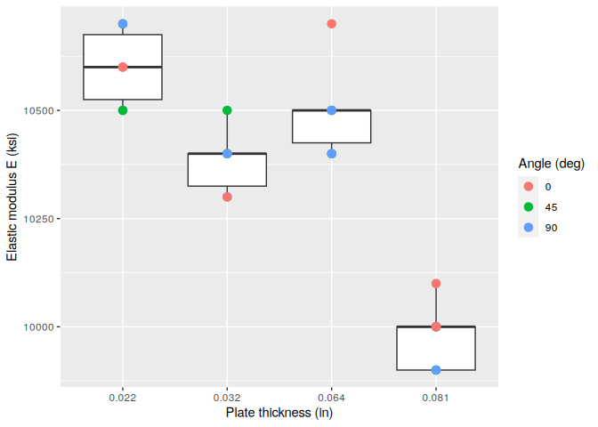
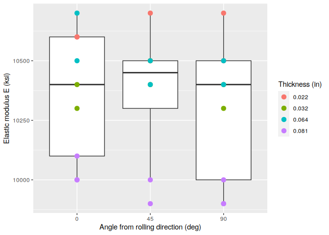
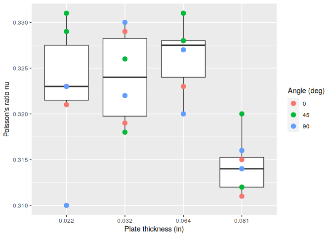
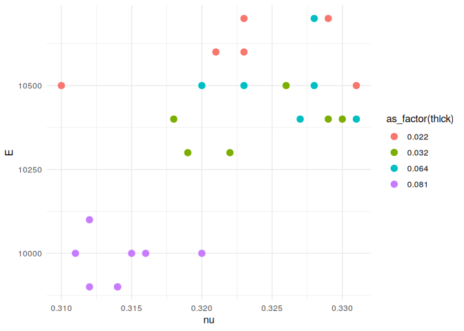

Aluminum Data
================
(Your name here)
2020-

- [Grading Rubric](#grading-rubric)
  - [Individual](#individual)
  - [Submission](#submission)
- [Loading and Wrangle](#loading-and-wrangle)
  - [**q1** Tidy `df_stang` to produce `df_stang_long`. You should have
    column names `thick, alloy, angle, E, nu`. Make sure the `angle`
    variable is of correct type. Filter out any invalid
    values.](#q1-tidy-df_stang-to-produce-df_stang_long-you-should-have-column-names-thick-alloy-angle-e-nu-make-sure-the-angle-variable-is-of-correct-type-filter-out-any-invalid-values)
- [EDA](#eda)
  - [Initial checks](#initial-checks)
    - [**q2** Perform a basic EDA on the aluminum data *without
      visualization*. Use your analysis to answer the questions under
      *observations* below. In addition, add your own *specific*
      question that you’d like to answer about the data—you’ll answer it
      below in
      q3.](#q2-perform-a-basic-eda-on-the-aluminum-data-without-visualization-use-your-analysis-to-answer-the-questions-under-observations-below-in-addition-add-your-own-specific-question-that-youd-like-to-answer-about-the-datayoull-answer-it-below-in-q3)
  - [Visualize](#visualize)
    - [**q3** Create a visualization to investigate your question from
      q2 above. Can you find an answer to your question using the
      dataset? Would you need additional information to answer your
      question?](#q3-create-a-visualization-to-investigate-your-question-from-q2-above-can-you-find-an-answer-to-your-question-using-the-dataset-would-you-need-additional-information-to-answer-your-question)
    - [**q4** Consider the following
      statement:](#q4-consider-the-following-statement)
- [References](#references)

*Purpose*: When designing structures such as bridges, boats, and planes,
the design team needs data about *material properties*. Often when we
engineers first learn about material properties through coursework, we
talk about abstract ideas and look up values in tables without ever
looking at the data that gave rise to published properties. In this
challenge you’ll study an aluminum alloy dataset: Studying these data
will give you a better sense of the challenges underlying published
material values.

In this challenge, you will load a real dataset, wrangle it into tidy
form, and perform EDA to learn more about the data.

<!-- include-rubric -->

# Grading Rubric

<!-- -------------------------------------------------- -->

Unlike exercises, **challenges will be graded**. The following rubrics
define how you will be graded, both on an individual and team basis.

## Individual

<!-- ------------------------- -->

| Category    | Needs Improvement                                                                                                | Satisfactory                                                                                                               |
|-------------|------------------------------------------------------------------------------------------------------------------|----------------------------------------------------------------------------------------------------------------------------|
| Effort      | Some task **q**’s left unattempted                                                                               | All task **q**’s attempted                                                                                                 |
| Observed    | Did not document observations, or observations incorrect                                                         | Documented correct observations based on analysis                                                                          |
| Supported   | Some observations not clearly supported by analysis                                                              | All observations clearly supported by analysis (table, graph, etc.)                                                        |
| Assessed    | Observations include claims not supported by the data, or reflect a level of certainty not warranted by the data | Observations are appropriately qualified by the quality & relevance of the data and (in)conclusiveness of the support      |
| Specified   | Uses the phrase “more data are necessary” without clarification                                                  | Any statement that “more data are necessary” specifies which *specific* data are needed to answer what *specific* question |
| Code Styled | Violations of the [style guide](https://style.tidyverse.org/) hinder readability                                 | Code sufficiently close to the [style guide](https://style.tidyverse.org/)                                                 |

## Submission

<!-- ------------------------- -->

Make sure to commit both the challenge report (`report.md` file) and
supporting files (`report_files/` folder) when you are done! Then submit
a link to Canvas. **Your Challenge submission is not complete without
all files uploaded to GitHub.**

``` r
library(tidyverse)
```

    ## -- Attaching core tidyverse packages ------------------------ tidyverse 2.0.0 --
    ## v dplyr     1.1.4     v readr     2.1.5
    ## v forcats   1.0.0     v stringr   1.5.1
    ## v ggplot2   3.4.4     v tibble    3.2.1
    ## v lubridate 1.9.3     v tidyr     1.3.1
    ## v purrr     1.0.2     
    ## -- Conflicts ------------------------------------------ tidyverse_conflicts() --
    ## x dplyr::filter() masks stats::filter()
    ## x dplyr::lag()    masks stats::lag()
    ## i Use the conflicted package (<http://conflicted.r-lib.org/>) to force all conflicts to become errors

*Background*: In 1946, scientists at the Bureau of Standards tested a
number of Aluminum plates to determine their
[elasticity](https://en.wikipedia.org/wiki/Elastic_modulus) and
[Poisson’s ratio](https://en.wikipedia.org/wiki/Poisson%27s_ratio).
These are key quantities used in the design of structural members, such
as aircraft skin under [buckling
loads](https://en.wikipedia.org/wiki/Buckling). These scientists tested
plats of various thicknesses, and at different angles with respect to
the [rolling](https://en.wikipedia.org/wiki/Rolling_(metalworking))
direction.

# Loading and Wrangle

<!-- -------------------------------------------------- -->

The `readr` package in the Tidyverse contains functions to load data
form many sources. The `read_csv()` function will help us load the data
for this challenge.

``` r
## NOTE: If you extracted all challenges to the same location,
## you shouldn't have to change this filename
filename <- "./data/stang.csv"

## Load the data
df_stang <- read_csv(filename)
```

    ## Rows: 9 Columns: 8
    ## -- Column specification --------------------------------------------------------
    ## Delimiter: ","
    ## chr (1): alloy
    ## dbl (7): thick, E_00, nu_00, E_45, nu_45, E_90, nu_90
    ## 
    ## i Use `spec()` to retrieve the full column specification for this data.
    ## i Specify the column types or set `show_col_types = FALSE` to quiet this message.

``` r
df_stang
```

    ## # A tibble: 9 x 8
    ##   thick  E_00 nu_00  E_45  nu_45  E_90 nu_90 alloy  
    ##   <dbl> <dbl> <dbl> <dbl>  <dbl> <dbl> <dbl> <chr>  
    ## 1 0.022 10600 0.321 10700  0.329 10500 0.31  al_24st
    ## 2 0.022 10600 0.323 10500  0.331 10700 0.323 al_24st
    ## 3 0.032 10400 0.329 10400  0.318 10300 0.322 al_24st
    ## 4 0.032 10300 0.319 10500  0.326 10400 0.33  al_24st
    ## 5 0.064 10500 0.323 10400  0.331 10400 0.327 al_24st
    ## 6 0.064 10700 0.328 10500  0.328 10500 0.32  al_24st
    ## 7 0.081 10000 0.315 10000  0.32   9900 0.314 al_24st
    ## 8 0.081 10100 0.312  9900  0.312 10000 0.316 al_24st
    ## 9 0.081 10000 0.311    -1 -1      9900 0.314 al_24st

Note that these data are not tidy! The data in this form are convenient
for reporting in a table, but are not ideal for analysis.

### **q1** Tidy `df_stang` to produce `df_stang_long`. You should have column names `thick, alloy, angle, E, nu`. Make sure the `angle` variable is of correct type. Filter out any invalid values.

*Hint*: You can reshape in one `pivot` using the `".value"` special
value for `names_to`.

``` r
## TASK: Tidy `df_stang`
df_stang_long <-
  df_stang |> 
  pivot_longer(
    cols = starts_with(c("E_", "nu_")),
    names_sep = "_",
    names_to = c(".value", "angle"),
    names_transform = list(angle = as.integer)
  ) |> 
  filter(
    E > 0 & nu > 0
  )

df_stang_long
```

    ## # A tibble: 26 x 5
    ##    thick alloy   angle     E    nu
    ##    <dbl> <chr>   <int> <dbl> <dbl>
    ##  1 0.022 al_24st     0 10600 0.321
    ##  2 0.022 al_24st    45 10700 0.329
    ##  3 0.022 al_24st    90 10500 0.31 
    ##  4 0.022 al_24st     0 10600 0.323
    ##  5 0.022 al_24st    45 10500 0.331
    ##  6 0.022 al_24st    90 10700 0.323
    ##  7 0.032 al_24st     0 10400 0.329
    ##  8 0.032 al_24st    45 10400 0.318
    ##  9 0.032 al_24st    90 10300 0.322
    ## 10 0.032 al_24st     0 10300 0.319
    ## # i 16 more rows

Use the following tests to check your work.

``` r
## NOTE: No need to change this
## Names
assertthat::assert_that(
              setequal(
                df_stang_long %>% names,
                c("thick", "alloy", "angle", "E", "nu")
              )
            )
```

    ## [1] TRUE

``` r
## Dimensions
assertthat::assert_that(all(dim(df_stang_long) == c(26, 5)))
```

    ## [1] TRUE

``` r
## Type
assertthat::assert_that(
              (df_stang_long %>% pull(angle) %>% typeof()) == "integer"
            )
```

    ## [1] TRUE

``` r
print("Very good!")
```

    ## [1] "Very good!"

# EDA

<!-- -------------------------------------------------- -->

## Initial checks

<!-- ------------------------- -->

### **q2** Perform a basic EDA on the aluminum data *without visualization*. Use your analysis to answer the questions under *observations* below. In addition, add your own *specific* question that you’d like to answer about the data—you’ll answer it below in q3.

``` r
df_stang_long 
```

    ## # A tibble: 26 x 5
    ##    thick alloy   angle     E    nu
    ##    <dbl> <chr>   <int> <dbl> <dbl>
    ##  1 0.022 al_24st     0 10600 0.321
    ##  2 0.022 al_24st    45 10700 0.329
    ##  3 0.022 al_24st    90 10500 0.31 
    ##  4 0.022 al_24st     0 10600 0.323
    ##  5 0.022 al_24st    45 10500 0.331
    ##  6 0.022 al_24st    90 10700 0.323
    ##  7 0.032 al_24st     0 10400 0.329
    ##  8 0.032 al_24st    45 10400 0.318
    ##  9 0.032 al_24st    90 10300 0.322
    ## 10 0.032 al_24st     0 10300 0.319
    ## # i 16 more rows

``` r
df_stang_thicknesses <-
  df_stang_long |> 
    group_by(thick) |> 
  summarize(n = n(), E_mean = mean(E), nu_mean = mean(nu))

df_stang_angles <-
  df_stang_long |> 
  group_by(angle) |> 
  summarize(n = n(), E_mean = mean(E), nu_mean = mean(nu))

df_stang_alloy <-
  df_stang_long |> 
  group_by(alloy) |> 
  summarize(n = n(), E_mean = mean(E), nu_mean = mean(nu))

df_stang_thicknesses
```

    ## # A tibble: 4 x 4
    ##   thick     n E_mean nu_mean
    ##   <dbl> <int>  <dbl>   <dbl>
    ## 1 0.022     6 10600    0.323
    ## 2 0.032     6 10383.   0.324
    ## 3 0.064     6 10500    0.326
    ## 4 0.081     8  9975    0.314

``` r
df_stang_angles
```

    ## # A tibble: 3 x 4
    ##   angle     n E_mean nu_mean
    ##   <int> <int>  <dbl>   <dbl>
    ## 1     0     9 10356.   0.320
    ## 2    45     8 10362.   0.324
    ## 3    90     9 10289.   0.320

``` r
df_stang_alloy
```

    ## # A tibble: 1 x 4
    ##   alloy       n E_mean nu_mean
    ##   <chr>   <int>  <dbl>   <dbl>
    ## 1 al_24st    26 10335.   0.321

**Observations**:

- Is there “one true value” for the material properties of Aluminum?
  - Doesn’t look like it. If there was, every row would have the same E
    and nu and they clearly don’t. E goes from about 9900 to 10700 and
    nu goes from about 0.31 to 0.33. Looking at the thickness table the
    0.081 plates have a mean E of about 10000 and the other three are
    all around 10400 to 10600, so it’s not even like the variation is
    random noise around one number, it moves with thickness. Probably
    there is some true value for a perfect chunk of aluminum but every
    real plate is a little different depending on how it was made.
- How many aluminum alloys are in this dataset? How do you know?
  - Just one, al_24st. When I group by alloy I only get one row back
    with all 26 measurements in it.
- What angles were tested?
  - 0, 45 and 90 degrees. The angle table has 3 rows. 0 and 90 have 9
    measurements each and 45 only has 8, because the one 45 degree test
    I filtered out in q1 was the invalid -1 row.
- What thicknesses were tested?
  - 0.022, 0.032, 0.064 and 0.081 inches. The first three have 6
    measurements each and 0.081 has 8
- Does plate thickness or test angle have a bigger effect on E and nu?
  - From the tables it looks like thickness. The angle table means are
    all within about 70 of each other (10290 to 10360) but the thickness
    table has the 0.081 plates about 500 lower than everything else. I
    want to plot it to make sure that’s not just the means hiding
    something.

## Visualize

<!-- ------------------------- -->

### **q3** Create a visualization to investigate your question from q2 above. Can you find an answer to your question using the dataset? Would you need additional information to answer your question?

``` r
## TASK: Investigate your question from q1 here
df_stang_long |>
  ggplot(aes(x = as_factor(thick), y = E)) +
  geom_boxplot() +
  geom_point(aes(colour = as_factor(angle)), size = 3) +
  labs(
    x = "Plate thickness (in)",
    y = "Elastic modulus E (ksi)",
    colour = "Angle (deg)"
  )
```

<!-- -->

``` r
df_stang_long |>
  ggplot(aes(x = as_factor(angle), y = E)) +
  geom_boxplot() +
  geom_point(aes(colour = as_factor(thick)), size = 3) +
  labs(
    x = "Angle from rolling direction (deg)",
    y = "Elastic modulus E (ksi)",
    colour = "Thickness (in)"
  )
```

<!-- -->

``` r
df_stang_long |>
  ggplot(aes(x = as_factor(thick), y = nu)) +
  geom_boxplot() +
  geom_point(aes(colour = as_factor(angle)), size = 3) +
  labs(
    x = "Plate thickness (in)",
    y = "Poisson's ratio nu",
    colour = "Angle (deg)"
  )
```

<!-- -->

**Observations**:

- First plot is E by thickness. The 0.081 box is sitting completely
  under the other three, the top of it is lower than the bottom of any
  other box. The thin plates are all around 10500 and the thick ones are
  around 10000, so about 5% lower. The other three thicknesses overlap
  each other a lot so I wouldn’t say there’s a trend across them, it’s
  more like 0.081 is different and the rest are the same.
- Inside each box the colors (angle) are all mixed up. There isn’t a
  color that’s always on top or always on the bottom, so angle doesn’t
  seem to be doing anything within a thickness.
- Second plot is the same data but with angle on the x axis. The three
  boxes are basically the same height and they overlap almost entirely.
  But every box has the purple 0.081 dots at the very bottom. So the
  spread inside each angle group is really just the thickness effect
  showing up again, not something angle is doing.
- Third plot is nu by thickness and it’s the same story but smaller. The
  0.081 plates are at about 0.31 and the rest are at about 0.32 to 0.33.
  Again the angle colors are mixed.
- So to answer my question, thickness has a much bigger effect than
  angle. Angle barely does anything I can see.
- The thing I can’t answer from this data is whether it’s actually
  thickness that’s causing it. There’s only 3 plates at 0.081 and 2 at
  each of the others, and it’s all one alloy. All three 0.081 plates
  could have come from the same batch of metal that just happened to be
  a little softer. Since every thick plate is in that batch there’s no
  way to separate “thick” from “that batch”. To actually pin it on
  thickness I’d want plates of each thickness from a couple different
  batches, or one thick sheet ground down to the thinner sizes so the
  metal is identical and only the thickness changes.

### **q4** Consider the following statement:

> “A material’s property (or material property) is an intensive property
> of some material, i.e. a physical property that does not depend on the
> amount of the material.”\[2\]

Note that the “amount of material” would vary with the thickness of a
tested plate. Does the following graph support or contradict the claim
that “elasticity `E` is an intensive material property.” Why or why not?
Is this evidence *conclusive* one way or another? Why or why not?

``` r
## NOTE: No need to change; run this chunk
df_stang_long %>%

  ggplot(aes(nu, E, color = as_factor(thick))) +
  geom_point(size = 3) +
  theme_minimal()
```

<!-- -->

**Observations**:

- Does this graph support or contradict the claim above?
  - Contradicts it, at least for this data. If E didn’t depend on the
    amount of material then the colors would be all mixed together on
    the plot. Instead the 0.081 points are off in their own cluster in
    the bottom left, lower E and lower nu than everything else. The
    other three thicknesses are jumbled together in the top right which
    is what you’d expect if E was intensive, so it’s really only the
    thickest plates that break the pattern.
- Is this evidence *conclusive* one way or another?
  - No. Same problem as q3, it’s one alloy and 2 or 3 plates per
    thickness. The whole contradiction rests on 3 plates that could all
    be from one batch. A different batch that was slightly off would
    look exactly like this and have nothing to do with thickness. Also
    the thin plates going 0.022 to 0.064 don’t show any trend at all, so
    if thickness really mattered I’d expect to see at least a little
    movement across those and there isn’t any. To be conclusive you’d
    want more plates at each thickness from different batches, and
    ideally some thicknesses between 0.064 and 0.081 to see if E drops
    gradually or just falls off a cliff.

# References

<!-- -------------------------------------------------- -->

\[1\] Stang, Greenspan, and Newman, “Poisson’s ratio of some structural
alloys for large strains” (1946) Journal of Research of the National
Bureau of Standards, (pdf
link)\[<https://nvlpubs.nist.gov/nistpubs/jres/37/jresv37n4p211_A1b.pdf>\]

\[2\] Wikipedia, *List of material properties*, accessed 2020-06-26,
(link)\[<https://en.wikipedia.org/wiki/List_of_materials_properties>\]
